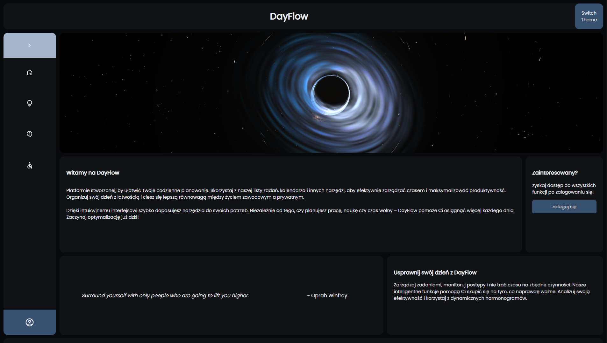
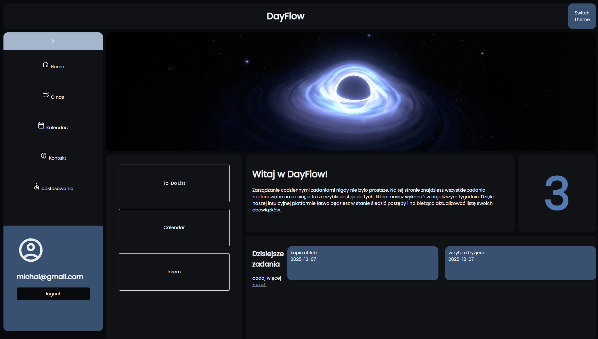
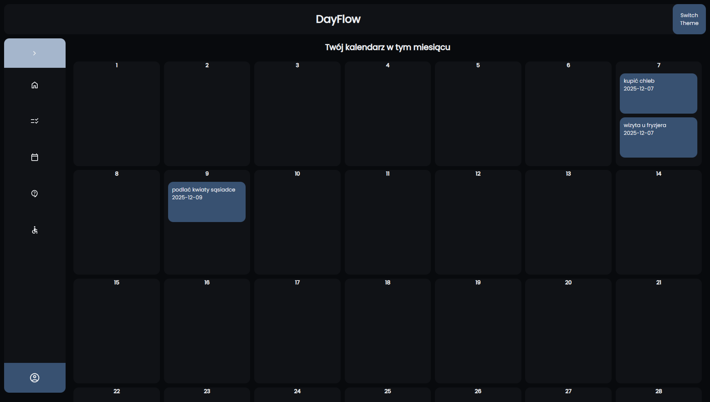
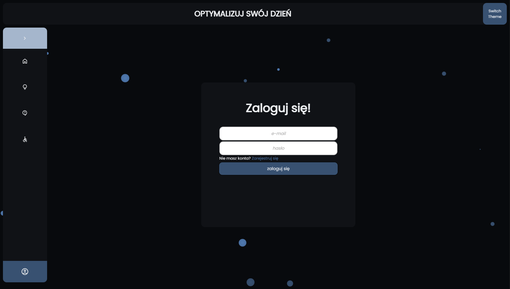
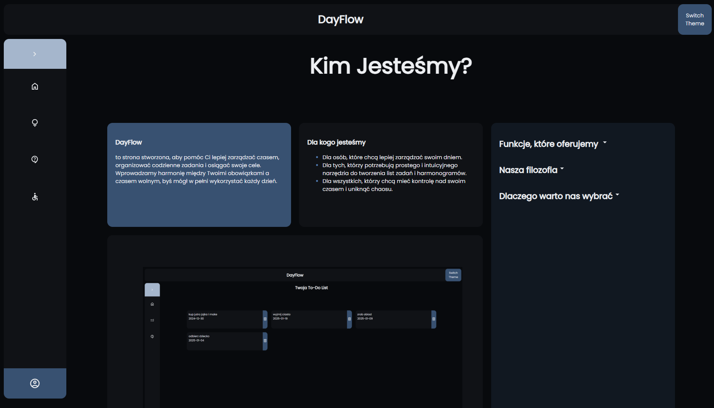

# 🌤️ DayFlow

A simple, elegant daily–planning web app built for learning frontend web development.

Note: This project was created as a **learning exercise**, and therefore uses localStorage for the login and registration system.
Because of that, authentication is not secure or production-ready.
DayFlow should be treated as a showcase/demo project only.

## 📸 Screenshots

<table>
  <tr>
    <td></td>
    <td></td>
    <td></td>
  </tr>
  <tr>
    <td></td>
    <td></td>
  </tr>
</table>

# ✨ Features

📝 Task Manager – Add, delete, and manage daily tasks

📅 Calendar - see and manage your tasks

💻 Fully responsive layout

🎨 Accessibility Options

# 💾 Local storage support

- Saves tasks locally in the browser
- Stores user account data locally (learning purpose only)

# 🛠️ Technologies Used

<table><tr><td>HTML5</td><td>localStorage API</td></tr><tr><td>CSS3</td><td>JavaScript (ES6+)</td></tr></table>

# ⚠️ Disclaimer
This project uses localStorage for handling:
user registration
user login
task storage

Because localStorage stores data in plain text in the browser, it is not secure and should never be used for real authentication.
DayFlow’s login system exists only for educational purposes — to practice DOM manipulation, state handling, and UI logic.

# 🚀 Running the Project

Clone the repository:

``
git clone https://github.com/<your-username>/DayFlow.git
``

Open index.html in your browser.

No build steps or server required.
